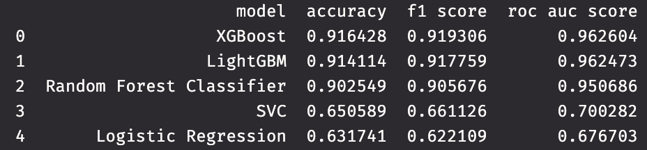
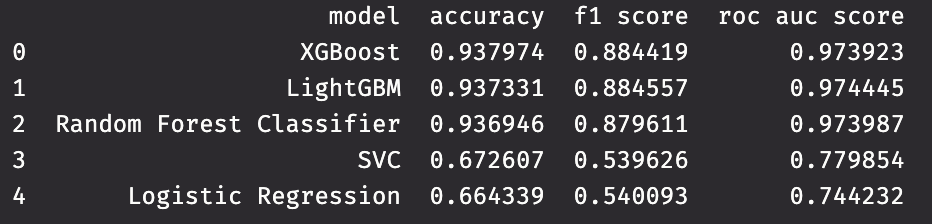
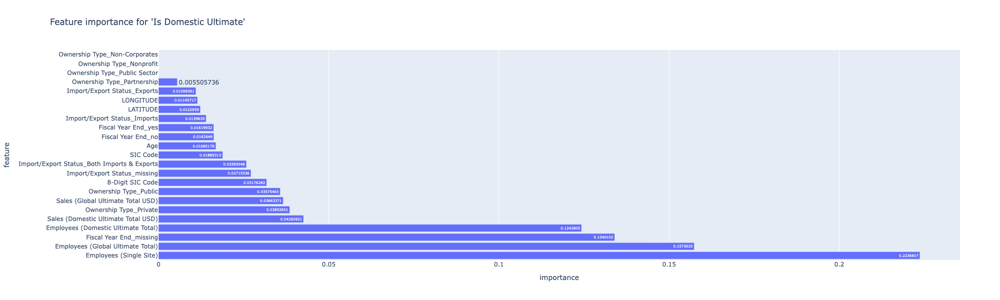
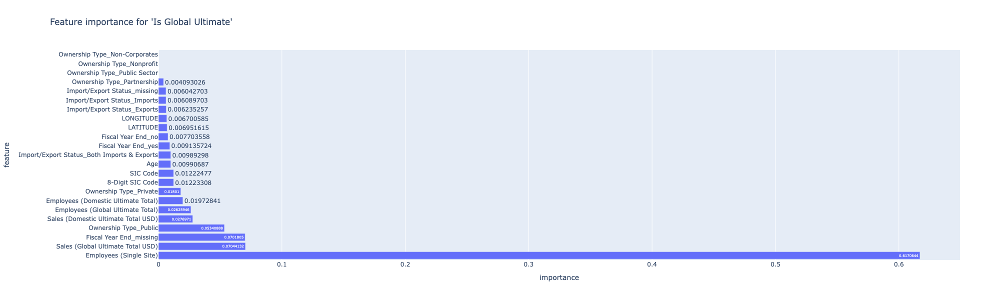
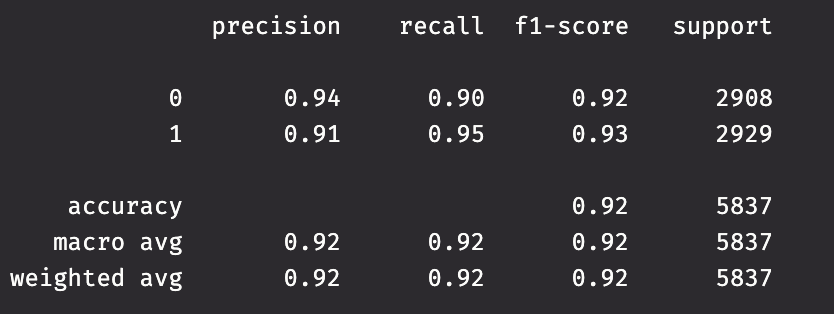
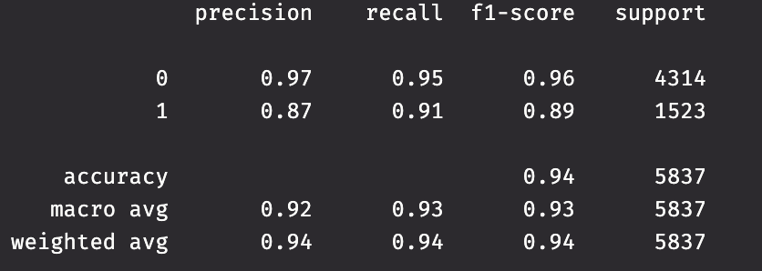

# NUS Datathon 2025

An annual Data Hackathon organised by National University of Singapore's Statistics and Data Science society.

**Team:** Cat B Team 27

**Team Members**:
- Chia Kai En Erika
- Jerome Chua Jun Zhang
- Lee Yan Le Shermaine

# Problem Statement  
Our task was to develop a robust machine learning model to predict the **'Is Domestic Ultimate'** and **'Is Global Ultimate'**
classifications for companies based on their operational, financial, and structural characteristics.

# Data Dictionary
- AccountID: A distinctive label or number assigned to a specific account within a system or organisation.
- Company: Company name
- SIC Code: Standard Industrial Classification (SIC) code is a numerical system
  used to classify and categorise industries based on their primary economic activities.
- Industry: Specific sector of economic activity
- 8-Digit SIC Code: A numerical code system used to classify and
  categorise industries based on their primary business activities.
- 8-Digit SIC Description: Description of the 8-digit SIC code.
- Year Found: Year in which an entity, such as a company or organisation, was founded or established.
- Ownership Type: The classification or categorization of the legal structure
  that dictates how a business entity is owned, managed, and organised.
- Company Description: A concise and informative overview that provides key details about a business entity.
- Square Footage: A unit of measure used to quantify the total area or size of a two-dimensional space.
- Company Status (Active/Inactive): The current standing or operational condition of a business entity,
  indicating whether it is currently active and conducting business or inactive
- Employees (Single Site): The total number of individuals employed by a company at a specific location or site.
- Employees (Domestic Ultimate Total): The total number of individuals employed
  by a company across all its domestic or home-country operations.
- Employees (Global Ultimate Total): The total number of individuals employed
  by a company across all its global operations. (Excluding Domestic)
- Sales (Domestic Ultimate Total USD): The total sales revenue generated by a
  company within its domestic or home country operations, measured in U.S. dollars.
- Sales (Global Ultimate Total USD): The total sales revenue generated by
  a company on a global scale, measured in U.S. dollars. (Excluding Domestic)
- Import/Export Status: The classification of a company based on its involvement
  in international trade, specifically with regard to importing and exporting goods.
- Fiscal Year End: The conclusion of a company's accounting and financial reporting period.
- Is Domestic Ultimate: A categorical attribute or indicator that signifies whether a particular entity or company
  is the ultimate or highest-level company within a corporate structure based in its home country.
- Is Global Ultimate: A categorical attribute or indicator that signifies whether a particular entity or company
  holds the status of being the ultimate or highest-level company within a corporate structure on a global scale.

# Approach
1. Data Cleaning
1. Feature Engineering
1. Train-Test Split
1. Model Selection
1. Feature Selection
1. Hyperparameter tuning
1. Model Stacking

# Data Cleaning
- Checking and dropping duplicates
- Column removal
  - Dropping identifiers columns ['AccountId', 'Company'].
  - Dropping descriptor columns in favour of unique categorical codes
    ['Company Description', 'Industry', '8-Digit SIC Description'].
  - Dropping 'Company Status (Active/Inactive)' column as there is only 1 unique value in the entire column. 
- Handling null values
  - Calculated the asolute number and percentage of null values per columns
  - Dropping columns with 100% null values.

# Feature engineering

### Data Imputation
- Impute missing categorical data  with "missing".
- For numerical columns, perform median imputation.

### Company age
- Mapping 'Year Found' column to the age of the company as of 2025 as we believe
  that it is more interpretable.

### Fiscal year end
- Since majority of the non-null values were on year end (i.e, 31 Dec), we
  decided to parse the date string into datetime and map it to whether
  it is at 31 Dec or not. 
- This is because we believe that there could be a standard financial accounting
  that companies will follow to ensure consistency.

### One Hot Encoding
- Since most models are unable to interprete categorical data directly,
  we converted them into numerical data.
- We decided to only do this for categorical data with less than 5 categories
  to avoid increasing the dimensional space excessively.

### Frequency Encoding
- For columns more than 5 categories (e.g, 'SIC Code' with more than 100 categories),
  we applied frequency encoding.

### Type Casting
- Cast all float64 data to float32 to make it more time memory efficient during
  computations and model building.

# Train-Test Split
- Given that we have 2 classification to predict, we decided to do separate models
  for each classification.
- This mean that there was also 2 separate train-test split done for each model.
- 80-20 split was done for both, with 80% being training data and 20% being test data.

# Model Testing
- Given that this is a classification problem, the models we decided to test are:
  - Logistic Regression
  - Random Forest
  - LightGBM
  - XGBoost
  - Support Vector Model (SVM)
- Since this is the initial testing of models, we used the default arguments for
  their parameters.
- We evaluated each model using 5-fold cross validation and
  scoring was based on their accuracy, F1 Score and ROC AUC Score.

### Considerations
- Since Logistic Regression is a linear model and SVM is either a linear
  or distance-based model, standard scaling was applied when training them.
- For **'Is Global Ultimate'**, we observed that the binary outcome is highly
  imbalanced. Hene when training the **'Is Global Ultimate'** models,
  We applied **SMOTE** on the training dataset to create a more balanced dataset
  without losing information.
- To handle all these considerations without making our code too verbose,
  we utilised the pipeline module from *imbalance-learn* package which help us apply
  the necessary transformations easily.

### Results
Our results showed that XGBoost performed the best on average across all 3 metrices
for both classification problems.

Other tree-based models (Random Forest and LightGBM) performed slightly worse 
while Logistic Regression and SVM had significantly lower scores.

We decided to select 3 models: XGBoost, Random Forest and LightGBM to be
our base models for model stacking.

#### Results for 'Is Domestic Ultimate'

#### Results for 'Is Global Ultimate'

# Feature Selection
Based on our [results](#results), we chose to employ the in built feature importances
in XGBoost to determine the important features of the dataset. 

XGBoost is able to filter out less important features and its trees
only split on features that improve prediction, which makes it suitable for 
determining important features.

 

We can see that non-corporates, non-profit and public sector
ownership types have no significiant to the model. But since our dataset already
has a relatively small number of features, we decided to keep them for the model.

# Hyperparameter tuning
For each of the models we selected for our stack, we decided to tune
each of their parameters in order to improve their performance.

Due to time constraints in the datathon, traditional grid search
method would have been too time consuming, hence we decided to use
Optuna for hyperparameter tuning and F1 Score as our evaluation metric.

Optuna uses Bayesian optimisation + Tree-structured Parzen Estimator (TPE) to efficienly
explore the parameter space.

# Model stacking
Our group also decided to employ model stacking for our final model. This is
because stacking allow us to leverage the strength of the different models to improve
performance.

Our base models will be the XGBoost, Random Forest and LightGBM models that have been optimised, 
we use Scikit-learn's StackingClassifier to build a model stack.

Our meta model will be a Logistic Regression Model as it is lightweight and to train and
easy to train.

# Final result

### Performance of 'Is Domestic Ultimate' model

### Performance of 'Is Global Ultimate' model

